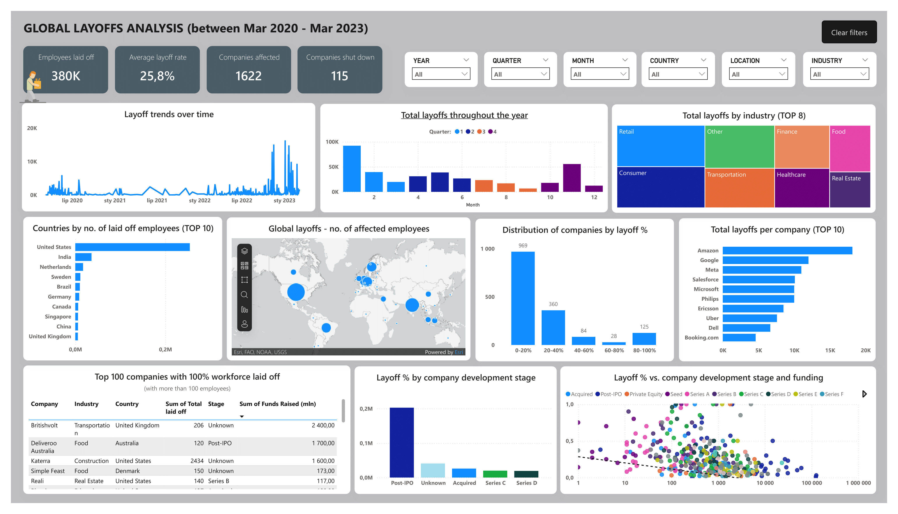

# Global Layoffs Data Analysis

## Project overview  
This project explores global layoffs between March 2020 and March 2023, covering data from 1,622 companies worldwide. The main goal was to understand when the biggest waves of layoffs happened and which industries, companies, and countries were hit the hardest. I also looked at how layoffs relate to company size and funding stage. The key insights are presented in a clear, interactive Power BI dashboard.

## Data preparation (SQL)
To ensure the data was clean and reliable, I performed several preprocessing steps:
- Removed duplicates  
- Standardized data formats  
- Handled missing values where possible  
- Adjusted data types  
- Filtered out irrelevant records  

## Exploratory Data Analysis (SQL)  
After cleaning, I conducted exploratory data analysis (EDA) to identify important trends and patterns, including mainly:
- Layoff trends over time  
- Most affected companies and industries  
- Geographic distribution of layoffs  

## Power BI dashboard
The final step was creating an easy-to-understand dashboard in Power BI. It highlights key trends across industries, countries, and time periods, making the insights accessible at a glance.

The repository includes a .pdf file containing a static preview of the dashboard, as well as a .pbix file for the full interactive experience.

Below is a quick static preview of the dashboard:

  

## Key insights

#### Timing of layoffs  
The largest layoff waves occurred in 2020, especially in May, July, and November. Another significant peak happened early 2023. Layoffs were generally more frequent in the first and last quarters of each year, notably in January and November.

#### Most impacted industries  
Retail, consumer goods, transportation, and finance sectors saw the highest layoffs overall. In 2020, transport and travel suffered most—likely due to the COVID-19 pandemic and related lockdowns. By 2023, layoffs were spread across various industries rather than concentrated.

#### Companies with the biggest layoffs  
Amazon led in total layoffs, though this accounted for just 3% of its workforce. Many smaller companies ceased operations entirely — 115 shut down, mostly in late 2022. On average, about 25% of employees were laid off in the analyzed firms, with nearly half laying off no more than 20%, and roughly one-third laying off between 20-40%.

#### Company size and funding stage  
Layoffs hit early-stage and smaller companies (Seed to Series C) the hardest in terms of number of companies affected. Larger, more established companies (Acquired and Post-IPO) laid off fewer employees proportionally, but in absolute numbers, Post-IPO companies accounted for the highest total layoffs.

#### Geographical distribution  
The United States experienced far more layoffs than any other country in the dataset.

## Data limitations  
Some missing values were present in columns:
- `total_laid_off`: 378 missing values  
- `percentage_laid_off`: 423 missing values  

While these gaps don’t majorly affect overall trends, they should be kept in mind when interpreting the results. The data comes from third-party sources, so in a real-world scenario, further validation with company HR records would be advisable.

## Tools used  
- **Microsoft SQL Server** - for data cleaning and preparation  
- **Power BI** - for data visualization and dashboard creation  

## Repository structure  
- `data/` - folder containing raw dataset:
  - `raw_data.csv` - source data file
- `sql/` - folder containing SQL scripts:
  - `data_cleaning.sql` - SQL script for data cleaning
  - `exploratory_data_analysis.sql` - SQL queries for exploratory data analysis
- `powerbi/` – folder with Power BI dashboard file:
  - `dashboard.pbix` - fully interactive dashboard file
  - `dashboard.pdf` - static file for quick dashboard overview
- `README.md` - project documentation
